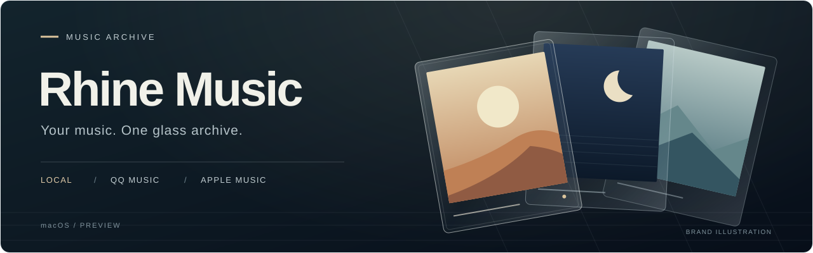
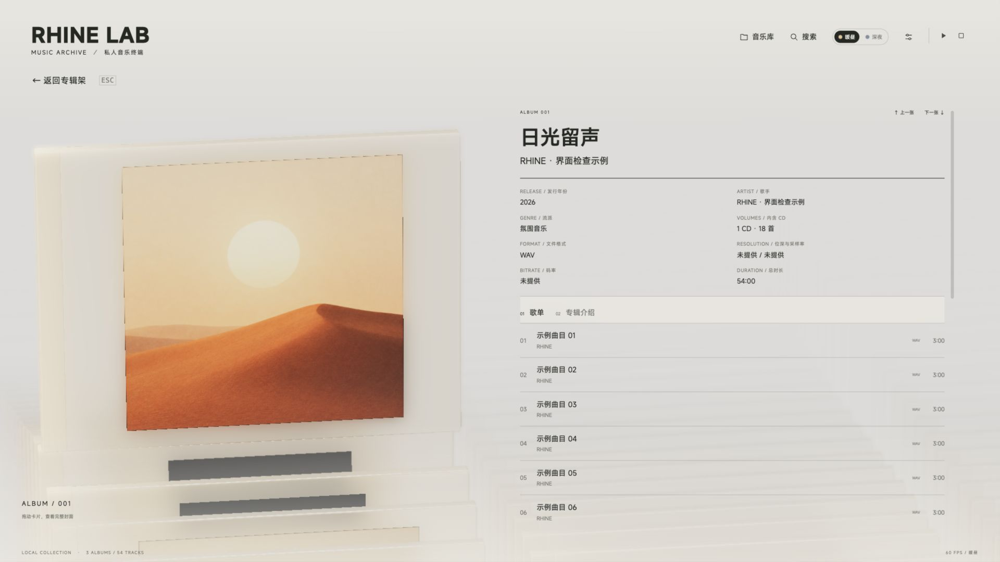

# Rhine Music

**把本地音乐、QQ 音乐和 Apple Music，放进同一个玻璃唱片架。**

[**下载 macOS 试用版 ↓**](https://github.com/YingYveltal/Rhine-Music/releases/download/v0.1.0-preview.3/Rhine-Music-Preview-v0.1.0-preview.3-macOS-arm64.zip) · [安装与使用](docs/PREVIEW.md) · [版本说明](https://github.com/YingYveltal/Rhine-Music/releases/tag/v0.1.0-preview.3) · [反馈问题](https://github.com/YingYveltal/Rhine-Music/issues)

**Apple Silicon（M 系列） · macOS 14+ · v0.1.0-preview.3 · 约 41 MB**

本次更新修复深夜主题的原生标题栏，以及含音乐视频的 Apple Music 专辑播放错误。

当前为公开 Preview，尚未经过 Apple 公证；暂无 Intel Mac 或 Windows 安装包。

音乐播放器基础来自 **[RonaldDeng / Rhine-Music-Demo](https://github.com/RonaldDeng/Rhine-Music-Demo)**；三维界面与动效基础来自 **[LBEILC / RhineLabUI](https://github.com/LBEILC/RhineLabUI)**。感谢两位原作者的开源工作。本仓库由 [YingYveltal](https://github.com/YingYveltal) 独立维护，是从上游 v0.3.0 移植快照继续开发的 macOS 衍生版本。

品牌示意图，非应用截图。[素材说明](docs/media/README.md)

## 让收藏回到唱片架

以三维玻璃唱片盒浏览专辑，切换暖昼与深夜主题，搜索专辑、歌曲和歌手。打开详情后选择曲目播放，点击顶部正在播放的歌名，可返回它所属的专辑或歌单。

| 音乐来源 | 可以做什么 | 从哪里开始 |
| --- | --- | --- |
| 本地音乐 | 扫描自己的音乐文件夹，读取标签与封面，浏览和播放 | 音乐库 → 选择文件夹 → 保存目录并扫描 |
| QQ 音乐 | QQ 扫码连接，同步自己的歌单与收藏专辑；也可读取本机 QQ 曲库快照 | 音乐库 → QQ 音乐 |
| Apple Music | 同步资料库中的专辑与歌单，保留实际收藏的曲目、曲号和碟号，使用原生 MusicKit 播放 | 音乐库 → 允许访问音乐资料库 → 同步我的资料库 |

QQ 与 Apple Music 的播放取决于自己的账号、订阅及曲目权限。安装包不附带歌曲、账号或私人曲库。尚未准备音乐时，可先打开内置的**演示封面**；演示模式没有可播放曲目。

三维画面的流畅度取决于设备与画质设置。大窗口下感觉卡顿时，可先在设置中降低画质；详见[试用说明](docs/PREVIEW.md#已知限制与排查)。

### 玻璃唱片架的设计来源

下图为 **RonaldDeng / Rhine-Music-Demo v0.3.0 的历史演示画面**，使用隔离示例库与抽象封面，展示本项目继承的唱片盒和详情布局。**不是当前 Preview 截图**，其中数量、曲目与帧率不代表本版实测。

历史图片及素材范围见[说明](docs/media/README.md)；当前 Preview 已增加 QQ 与 Apple Music 接入，功能以本文和试用说明为准。

## 三步开始

1. 下载上方 ZIP 并解压，将 **Rhine Music Preview.app** 拖入“应用程序”。无需安装 Node.js 或 Rust；Release 下的 **Source code** 是源码，不是应用安装包。
2. 打开应用。由于当前包未公证，首次打开可能被 macOS 拦截，请先阅读[安装说明](docs/PREVIEW.md#下载与安装)。
3. 在“音乐库”连接所需来源，再从卡片架或“搜索”选择专辑和歌曲。

[完整使用说明与常见问题 →](docs/PREVIEW.md)

## 试用前了解

- **Apple Music 音量与淡入淡出：** 当前不支持应用内调整，请使用输出设备可用的音量控制。[Issue #41](https://github.com/YingYveltal/Rhine-Music/issues/41)
- **偶发空同步：** 新加入的 Apple 资料库内容可能只读到名称而没有曲目。界面会提示未确认，可稍后重新同步；有限重读不代表问题已完全修复。[Issue #40](https://github.com/YingYveltal/Rhine-Music/issues/40)
- **媒体支持：** 暂不支持 Apple Music 音乐视频播放，也不支持本地 DSF / DFF 播放；不承诺 DSD 或无损直出。
- **验证范围：** 当前包在开发 Mac 上完成了有界实测与独立复核，其他设备、账号、网络环境仍需要试用反馈。详细范围和文件校验见 [Release](https://github.com/YingYveltal/Rhine-Music/releases/tag/v0.1.0-preview.3)。

遇到问题请在 [Issues](https://github.com/YingYveltal/Rhine-Music/issues) 提供版本、macOS 与芯片型号、复现步骤及错误提示。请先移除截图和日志里的账号、密钥、私人曲库及本机路径。

## 文档与来源

[文档导航](docs/README.md) · [开发与构建](docs/DEVELOPMENT.md) · [完整署名与资源来源](NOTICE.md) · [代码许可证](LICENSE)

本仓库保留 LBEILC 与 RonaldDeng 的版权声明。程序代码沿用 MIT；字体、声音采样、原作相关模型及其他非代码资源遵循各自的许可与权利范围，**不是全部资源都适用 MIT**。

上游 v0.3.0 的[历史说明与演示画面](frontend/README.md)仍保留，不能视作本 Preview 的当前截图或验收结果。上游后续版本的功能并未自动合入本仓库。
